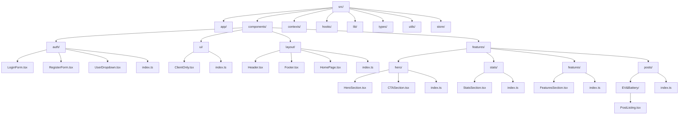

# Cấu trúc thư mục dự án EVB Platform

## Tổng quan
Dự án đã được tổ chức lại theo cấu trúc modular để dễ phát triển và bảo trì.

## Cấu trúc thư mục

```
src/
├── app/                    # Next.js App Router
│   ├── dashboard/         # Trang dashboard
│   ├── login/             # Trang đăng nhập
│   ├── register/          # Trang đăng ký
│   ├── post-listing/      # Trang danh sách bài đăng
│   ├── profile/           # Trang profile
│   └── ...
├── components/            # Tất cả React components
│   ├── auth/              # Components liên quan đến authentication
│   │   ├── LoginForm.tsx
│   │   ├── RegisterForm.tsx
│   │   ├── UserDropdown.tsx
│   │   └── index.ts
│   ├── ui/                 # UI components có thể tái sử dụng
│   │   ├── ClientOnly.tsx
│   │   └── index.ts
│   ├── layout/             # Layout components
│   │   ├── Header.tsx
│   │   ├── Footer.tsx
│   │   ├── HomePage.tsx
│   │   └── index.ts
│   ├── features/           # Feature-specific components
│   │   ├── hero/           # Hero section components
│   │   │   ├── HeroSection.tsx
│   │   │   ├── CTASection.tsx
│   │   │   └── index.ts
│   │   ├── stats/          # Statistics components
│   │   │   ├── StatsSection.tsx
│   │   │   └── index.ts
│   │   ├── features/       # Features showcase components
│   │   │   ├── FeaturesSection.tsx
│   │   │   └── index.ts
│   │   └── posts/          # Post-related components
│   │       ├── EV&Battery/
│   │       │   └── PostListing.tsx
│   │       └── index.ts
│   └── index.ts            # Barrel exports cho tất cả components
├── contexts/               # React contexts
│   └── AuthContext.tsx
├── hooks/                  # Custom hooks
│   └── useLocalStorage.ts
├── lib/                    # External libraries và API
│   └── api.ts
├── types/                  # TypeScript type definitions
│   └── index.ts
├── utils/                  # Utility functions
│   └── index.ts
└── store/                  # State management
```

## Sơ đồ cấu trúc



## Nguyên tắc tổ chức

### 1. Components được nhóm theo chức năng
- **auth/**: Tất cả components liên quan đến authentication
- **ui/**: UI components có thể tái sử dụng
- **layout/**: Components cho layout chính của ứng dụng
- **features/**: Components theo tính năng cụ thể

### 2. Barrel Exports
Mỗi thư mục có file `index.ts` để export tất cả components trong thư mục đó, giúp import dễ dàng hơn:

```typescript
// Thay vì
import LoginForm from '@/components/auth/LoginForm';
import RegisterForm from '@/components/auth/RegisterForm';

// Có thể dùng
import { LoginForm, RegisterForm } from '@/components/auth';
// hoặc
import { LoginForm, RegisterForm } from '@/components';
```

### 3. Types và Utils riêng biệt
- **types/**: Chứa tất cả TypeScript type definitions
- **utils/**: Chứa các utility functions có thể tái sử dụng

## Lợi ích của cấu trúc mới

1. **Dễ tìm kiếm**: Components được nhóm theo chức năng rõ ràng
2. **Dễ bảo trì**: Mỗi tính năng có thư mục riêng
3. **Tái sử dụng**: UI components được tách riêng
4. **Scalable**: Dễ dàng thêm tính năng mới
5. **Import sạch**: Sử dụng barrel exports

## Cách thêm component mới

1. Xác định loại component (auth/ui/layout/features)
2. Tạo file component trong thư mục phù hợp
3. Cập nhật file `index.ts` trong thư mục đó
4. Nếu cần, cập nhật file `index.ts` chính của components

## Ví dụ thêm component mới

```typescript
// Tạo file: src/components/ui/Button.tsx
export const Button = ({ children, ...props }) => {
  return <button {...props}>{children}</button>;
};

// Cập nhật: src/components/ui/index.ts
export { Button } from './Button';

// Sử dụng trong app
import { Button } from '@/components';
```

## Các thay đổi đã thực hiện

✅ **Tạo cấu trúc thư mục mới**
- Tạo thư mục `auth/`, `ui/`, `layout/`, `features/`
- Tạo thư mục con trong `features/`: `hero/`, `stats/`, `features/`, `posts/`
- Tạo thư mục `types/` và `utils/`

✅ **Di chuyển components**
- Di chuyển `LoginForm.tsx`, `RegisterForm.tsx`, `UserDropdown.tsx` vào `auth/`
- Di chuyển `Header.tsx`, `Footer.tsx`, `HomePage.tsx` vào `layout/`
- Di chuyển `ClientOnly.tsx` vào `ui/`
- Di chuyển các component features vào thư mục con phù hợp

✅ **Tạo barrel exports**
- Tạo file `index.ts` cho mỗi thư mục
- Tạo file `index.ts` chính cho components

✅ **Cập nhật import paths**
- Cập nhật tất cả import paths trong các file app
- Sử dụng barrel exports để import sạch hơn

✅ **Tạo types và utils**
- Tạo file `types/index.ts` với các type definitions
- Tạo file `utils/index.ts` với các utility functions

✅ **Kiểm tra và sửa lỗi**
- Kiểm tra linting errors
- Dọn dẹp các file và thư mục không cần thiết

Dự án của bạn giờ đây đã có cấu trúc gọn gàng, dễ phát triển và bảo trì! 🎉